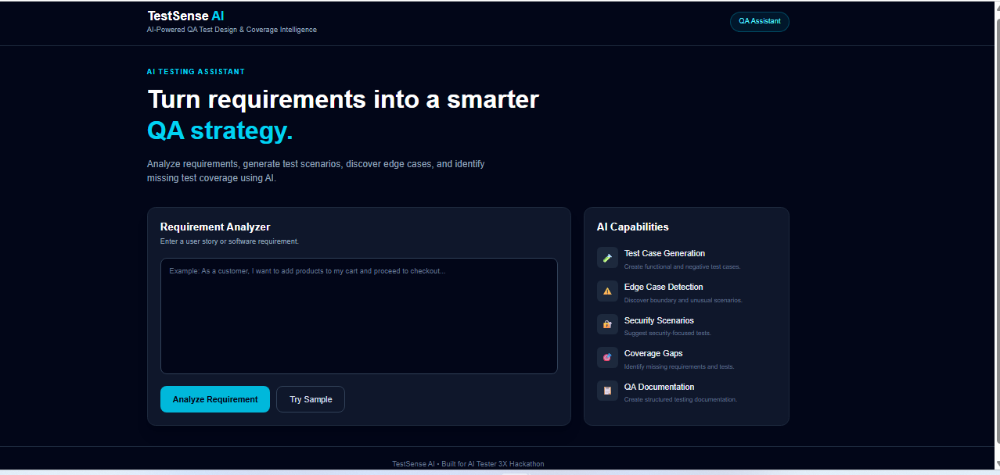
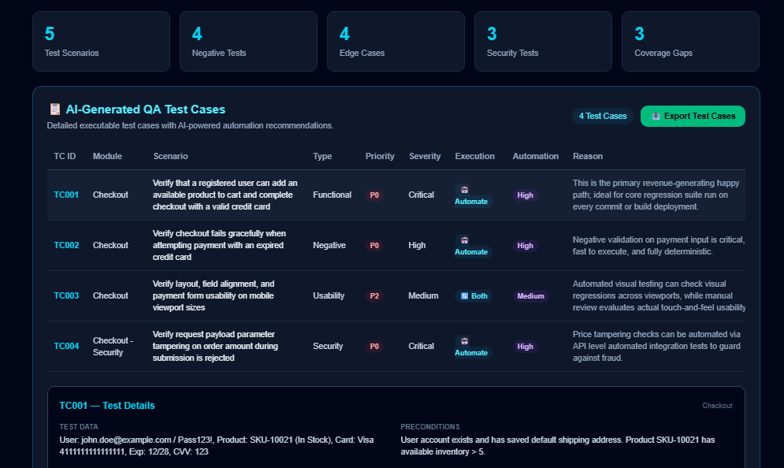
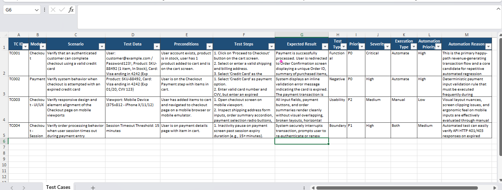

# TestSense AI

## AI-Powered QA Test Design & Coverage Intelligence

TestSense AI is an AI-powered QA assistant that transforms software requirements into a structured, execution-ready testing strategy.

It uses Artificial Intelligence to analyze requirements, identify quality and risk areas, generate test scenarios and detailed test cases, discover negative and edge cases, identify security scenarios, detect coverage gaps, and recommend whether each test case should be automated, manually executed, or covered by both approaches.

---

## 🚀 AI Tester 3X Hackathon

**Project:** TestSense AI
**Category:** AI-Powered Software Testing / QA
**Built for:** AI Tester 3X Hackathon

TestSense AI focuses on solving a real-world QA problem: reducing the time and effort required to convert software requirements into comprehensive and actionable testing documentation.

---

## 🎯 Problem Statement

QA engineers spend significant time manually analyzing software requirements and converting them into test scenarios and detailed test cases.

During manual test design, important areas can be missed, including:

* Negative scenarios
* Boundary and edge cases
* Security risks
* Requirement ambiguities
* Coverage gaps
* Automation opportunities

This can result in incomplete test coverage, increased testing effort, and higher risk of defects reaching production.

---

## 💡 Solution

TestSense AI uses Google's Gemini AI to analyze software requirements and automatically generate a structured QA testing strategy.

The application takes a software requirement as input and produces actionable QA insights, including:

* Requirement quality score
* Risk assessment
* Requirement quality findings
* Functional test scenarios
* Negative test scenarios
* Edge cases
* Security test scenarios
* Coverage gaps
* Detailed executable test cases
* Automation recommendations
* Excel test-case export

The goal is to help QA engineers move from:

**Requirement → Analysis → Test Design → Coverage → Execution Strategy**

in a much faster and more structured way.

---

## 🏗️ Technology Stack

### Frontend

* **Next.js**
* **React**
* **Tailwind CSS**

### AI

* **Google Gemini API**
* **Gemini 2.5 Flash**

### Backend

* **Next.js API Routes / Server-side API integration**

### Test Case Export

* **ExcelJS**

### Deployment

* **Vercel**

### Source Code

* **GitHub**

---

## 🏛️ Application Architecture

```text
                    User
                     │
                     ▼
              ┌───────────────┐
              │   TestSense   │
              │      AI UI    │
              └───────┬───────┘
                      │
                      ▼
              ┌───────────────┐
              │  Requirement  │
              │     Input     │
              └───────┬───────┘
                      │
                      ▼
              ┌───────────────┐
              │  Next.js API  │
              │     Layer     │
              └───────┬───────┘
                      │
                      ▼
              ┌───────────────┐
              │  Gemini AI    │
              │     Model     │
              └───────┬───────┘
                      │
                      ▼
             Structured QA Result
                      │
        ┌─────────────┼─────────────┐
        ▼             ▼             ▼
   Test Scenarios  Test Cases   Coverage
        │             │             │
        ▼             ▼             ▼
   Negative /      Automation     Risk &
   Edge / Security Recommendation  Gaps
                      │
                      ▼
                Excel Export
```

---

## ✨ Key Features

### 🧠 1. AI Requirement Analysis

Analyzes the provided software requirement and evaluates:

* Requirement quality score
* Risk level
* Requirement clarity
* Completeness
* Testability
* Ambiguity
* Missing information

This helps QA engineers understand the quality and risk of a requirement before starting detailed test design.

---

### 🧪 2. Test Scenario Generation

Automatically generates practical QA test scenarios covering areas such as:

* Functional testing
* Negative testing
* Boundary conditions
* Usability scenarios
* Business rules
* User workflows

---

### ❌ 3. Negative Test Generation

Identifies failure and invalid-condition scenarios such as:

* Invalid inputs
* Missing mandatory fields
* Invalid credentials
* Payment failures
* API failures
* Invalid user actions
* Incorrect data
* System failure conditions

---

### ⚠️ 4. Edge Case Detection

Identifies unusual, boundary, and less-obvious conditions that may not be explicitly mentioned in the requirement.

Examples include:

* Maximum/minimum values
* Empty values
* Duplicate actions
* Concurrent actions
* Session expiration
* Network interruptions
* Unexpected state changes

---

### 🔐 5. Security Test Scenarios

Generates security-focused test ideas based on the requirement.

Examples include:

* Cross-Site Scripting (XSS)
* SQL Injection
* Cross-Site Request Forgery (CSRF)
* Insecure Direct Object Reference (IDOR)
* Sensitive data exposure
* Authentication and authorization issues
* Price/data tampering
* Input validation vulnerabilities

---

### 🎯 6. Coverage Gap Detection

Analyzes the requirement and generated testing strategy to identify areas that may require additional testing.

It can highlight gaps related to:

* Missing business rules
* Unclear acceptance criteria
* Missing error handling
* User roles
* Payment scenarios
* Inventory/state validation
* Integration behaviour
* Boundary conditions

---

### 📋 7. AI-Generated Detailed Test Cases

TestSense AI converts requirements and scenarios into execution-ready test cases.

Generated test cases can contain:

* Test Case ID
* Module
* Test Scenario
* Test Data
* Preconditions
* Test Steps
* Expected Result
* Test Type
* Priority
* Severity
* Execution Type
* Automation Priority
* Automation Reason

This makes the output useful for actual QA documentation rather than just providing generic AI suggestions.

---

### 🤖 8. AI Automation Recommendation

One of the key features of TestSense AI is its ability to recommend how a test case should be executed.

Each test case can be classified as:

* **Automate**
* **Manual**
* **Both**

The AI also provides:

* Automation Priority
* Reason for the recommendation

For example:

**Automate**

> Suitable for automation because the scenario is repetitive, deterministic, and likely to be executed frequently during regression testing.

**Manual**

> Better suited for manual testing because it requires visual or exploratory validation.

**Both**

> Automation can validate the functional behaviour while manual testing can provide additional exploratory or usability coverage.

---

### 📊 9. Excel Test Case Export

Generated test cases can be exported into an Excel file for further QA documentation and execution.

The exported spreadsheet is structured for practical QA usage and includes:

* Test Case ID
* Module
* Scenario
* Test Data
* Preconditions
* Test Steps
* Expected Result
* Test Type
* Priority
* Severity
* Execution Type
* Automation Priority
* Automation Reason

---

## 🔄 End-to-End Workflow

```text
1. Enter Software Requirement
              ↓
2. AI Requirement Analysis
              ↓
3. Requirement Quality & Risk Assessment
              ↓
4. Generate Test Scenarios
              ↓
5. Generate Negative & Edge Cases
              ↓
6. Generate Security Scenarios
              ↓
7. Identify Coverage Gaps
              ↓
8. Generate Detailed Test Cases
              ↓
9. Recommend Automation / Manual / Both
              ↓
10. Export Test Cases to Excel
```

---

## 🖥️ Example Use Case

A QA engineer can provide a requirement such as:

> "Users should be able to add products to the shopping cart, proceed to checkout, make a payment, and receive an order confirmation."

TestSense AI can analyze the requirement and identify:

* Functional scenarios
* Negative payment scenarios
* Empty cart scenarios
* Inventory changes
* Invalid payment details
* Security scenarios
* Requirement gaps
* Checkout edge cases
* Regression candidates
* Automation opportunities

Instead of manually creating the entire testing strategy, the QA engineer receives a structured starting point that can be reviewed and refined.

---

## 🛠️ Getting Started

### Prerequisites

Make sure the following are installed:

* Node.js
* npm
* Git

You also need a valid Gemini API key for AI functionality.

---

## 📥 Installation

Clone the repository:

```bash
git clone https://github.com/Archana35-stack/testsense-ai.git
```

Navigate to the project directory:

```bash
cd testsense-ai
```

Install dependencies:

```bash
npm install
```

---

## 🔑 Environment Variables

Create a `.env.local` file in the project root.

Add your Gemini API key:

```env
GEMINI_API_KEY=your_gemini_api_key
```

> Do not commit `.env.local` or expose your API key in the GitHub repository.

---

## ▶️ Run the Application Locally

Start the development server:

```bash
npm run dev
```

Open the application in your browser:

```text
http://localhost:3000
```

---

## 🏗️ Production Build

Create a production build:

```bash
npm run build
```

Run the production application:

```bash
npm start
```

---

## ☁️ Deployment

TestSense AI is designed to be deployed using **Vercel**.

Deployment flow:

```text
GitHub Repository
       ↓
     Vercel
       ↓
Next.js Application
       ↓
   Production URL
```

After deployment, configure the required environment variable in Vercel:

```text
GEMINI_API_KEY
```

The deployed application is available here:

**Live Demo:** https://testsense-ai-nine.vercel.app

---

## 📸 Screenshots

### Dashboard / Requirement Analysis



### AI Requirement Analysis


### Generated Test Cases




### Excel Export




---

## 📂 Project Structure

testsense-ai/
│
├── app/
│   ├── api/
│   ├── components/
│   └── ...
│
├── public/
├── Screenshots/
├── package.json
├── README.md
└── .gitignore

---

## 🔒 Security
API keys and other sensitive configuration values should be stored using environment variables.

Never commit the following to GitHub:

```text
.env
.env.local
API keys
Secret keys
Passwords
Access tokens
```

---

## 🚀 Future Enhancements

Potential future improvements include:

* Import requirements from Jira, Confluence, or documents
* Jira integration
* Test management tool integration
* AI-generated automation scripts
* Selenium/Playwright code generation
* API test generation
* Gherkin / Cucumber scenario generation
* Defect prediction
* Traceability matrix generation
* Test execution tracking
* Requirement-to-test-case traceability
* CI/CD integration
* AI-powered test prioritization

---

## 🏆 Hackathon Value Proposition

TestSense AI demonstrates how AI can assist QA engineers across multiple stages of the software testing lifecycle.

Instead of using AI only for generating test cases, TestSense AI combines:

**Requirement Intelligence + Risk Analysis + Test Design + Security Thinking + Coverage Analysis + Automation Decision Support**

This makes it a practical AI-powered QA productivity solution.

---

## 👩‍💻 Author

**Archana Nathe**

Built as part of the **AI Tester 3X Hackathon**.

---

## 📌 Project Links

### GitHub Repository

[View Source Code](https://github.com/Archana35-stack/testsense-ai)

### Live Demo

[Open TestSense AI](https://testsense-ai-nine.vercel.app)

---

## 📄 License

This project was created for the AI Tester 3X Hackathon and is intended for educational and demonstration purposes.